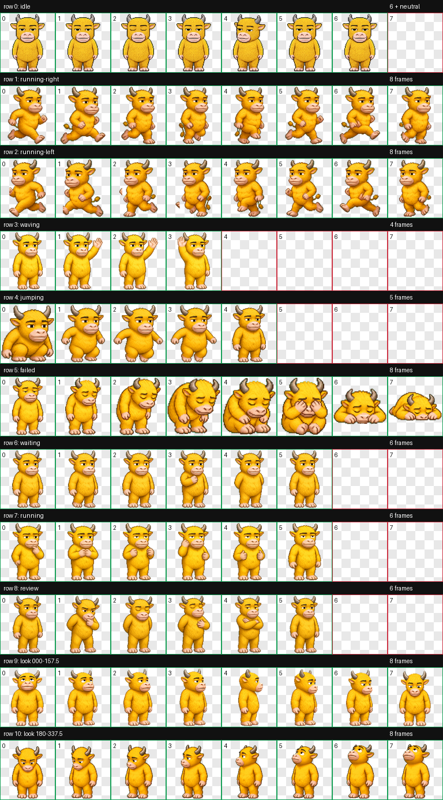

# 牛来 Codex Pet

> 本页默认使用简体中文，安装与排障命令适用于 Windows。

## 中文简介

这是一个以电影《牛来》成年黄牛形态为视觉依据的 Codex v2 像素宠物。它有完整动画、“牛来签”中文便笺、单击/悬停/拖动反馈，以及适配 Windows Codex 透明宠物窗口的点击输入桥。

English introduction

Niulai is an unofficial, non-commercial Codex v2 pixel pet inspired by the adult yellow bull from the film. It includes a complete animation atlas, Chinese “Niulai Notes,” click/hover/drag responses, and Windows helpers for the transparent Codex pet window.

## 功能

- Codex v2 动画图集：8 × 11，1536 × 2288，192 × 208 单元格。
- 成年黄色牛来：灰角、粗眉、半眯眼、大浅色牛鼻。
- 100 条固定台词，其中新增 20 条《牛来》剧情与网络梗化用，覆盖绊倒体、豹拉、云雀入梦、86 分钟和“牛市来”等元素。
- 27,648 种可组合的原创短句模板；不调用外部 API，也不上传工作内容。
- 默认每 3–7 分钟随机说一次话。
- 单击牛来说话；双击牛来才把 Codex 主窗口唤到前台。
- 悬停、拖动和任务状态可触发不同台词。
- 气泡已改为暖黄色“牛来签”：篮球图标替换为稳定显示的“牛”字徽章。
- 跟随牛来所在显示器自动计算工作区和 DPI；小屏、笔记本、高分屏及混合缩放多屏均会调整宽度、字号和最大高度。

## 与“鸡哥”共存

牛来安装在独立目录 pets\niulai-film-pet，不会修改、覆盖或卸载 professor-cluckshot。

两个宠物的说话/点击助手都作用于同一个 Codex 宠物窗口，因此同一时刻只应运行一套助手。Start-Niulai.ps1 检测到鸡哥助手正在运行时会安全拒绝启动，不会替你停止或修改鸡哥。切换时先运行当前宠物的停止脚本，再启动另一个。

## 安装

要求 Windows 10/11、Windows PowerShell 5.1，以及支持 Codex v2 自定义宠物的 Codex Desktop。在此目录打开 PowerShell：

    powershell -NoProfile -ExecutionPolicy Bypass -File .\Install-Niulai.ps1

安装器优先使用 `CODEX_HOME`，否则使用当前用户的 `.codex` 目录。它会安装并立即启动牛来助手，同时注册隐藏的登录自启动项，但不重启 Codex。随后在 Codex 的宠物列表中刷新并选择“牛来”。自定义 Codex 目录时可显式传入：

    powershell -NoProfile -ExecutionPolicy Bypass -File .\Install-Niulai.ps1 -CodexHome $env:CODEX_HOME

如果只想本次临时运行、不希望登录自启动，可改用：

    powershell -NoProfile -ExecutionPolicy Bypass -File .\Install-Niulai.ps1 -NoStartup

临时模式下，Windows 重启或注销后需手动运行 `Start-Niulai.ps1`，否则点击不会触发说话气泡。

## 运行控制

    .\Start-Niulai.ps1
    .\Stop-Niulai.ps1
    .\Start-Niulai.ps1 -MinIntervalSeconds 180 -MaxIntervalSeconds 420

手动让牛来说一句：

    .\Show-Niulai.ps1 -Trigger click -VisibleSeconds 15

只读检查安装和运行状态：

    powershell -NoProfile -ExecutionPolicy Bypass -File .\Get-NiulaiStatus.ps1

状态输出中的 `bubbleLayout` 会报告当前显示器、DPI、布局档位、气泡宽度和字号，方便在不同电脑上排查。

## 卸载牛来

    powershell -NoProfile -ExecutionPolicy Bypass -File .\Uninstall-Niulai.ps1

卸载器只会停止牛来的两个助手、移除牛来的登录启动项，并删除经过路径校验的 pets\niulai-film-pet 独立目录；不会影响鸡哥、其他宠物或 Codex 安装文件。

## 文件

- pet.json：Codex v2 宠物清单。
- spritesheet.webp：最终 8 × 11 动画图集。
- CodexPetInputBridge.ps1：Windows 宠物点击和拖动输入桥。
- NiulaiOverlay.ps1：说话气泡、任务状态与交互检测。
- niulai-talk-dialogue.json：固定台词和动态模板。
- Install-Niulai.ps1 / Uninstall-Niulai.ps1：安装与卸载。
- Start-Niulai.ps1 / Stop-Niulai.ps1：运行控制。
- Get-NiulaiStatus.ps1：只读状态诊断。

## GitHub 发布

- 仓库根目录应保留 `README.md`、`LICENSE`、`ASSET_NOTICE.md` 和 `.gitignore`。
- 不要提交运行时生成的 PID、点击事件、命令和状态 JSON；本包的 `.gitignore` 已覆盖这些文件。
- `spritesheet.webp` 是非商业同人角色图，不属于 MIT 许可。公开仓库或 Release 必须保留 `ASSET_NOTICE.md`，并在发布前自行确认角色图的传播授权边界。
- 台词均为原创短句或对公开剧情/网络梗的短小化用，不包含电影音视频、剧照或大段原台词。

## 1.1.2 更新

- 单击不再等待完整双击时间，第一次点击立即出现“牛来签”。
- 拖动通过 Codex 原生指针链路回放，牛来的左右奔跑动作会跟随鼠标方向。
- 拖动消息按约 60 Hz 合并，减少跟手延迟和松开后的补跳。
- 松开拖动后立即给出拖动台词，同时继续保留防粘鼠标保护。

## 1.1.1 更新

- 修复快速单击时，低级输入钩子的按下/抬起事件落在相邻轮询批次而被提前清空的问题。
- 保留防止鼠标释放丢失的保护，并增加 250 ms 有界配对窗口与运行诊断。
- 状态脚本可在 Codex 内置 PowerShell 与标准 Windows PowerShell 间自动选择可用探测程序。

## 1.1.0 更新

- 新增 20 条电影梗台词，固定台词总数增至 100。
- 篮球图标替换为“牛”字徽章，说话框改为“牛来签”便笺样式。
- 新增按宠物所在显示器工作的 DPI、多屏和笔记本自适应布局。
- 安装结果从 `package-version.json` 读取版本，便于 GitHub Release 与本地安装保持一致。

## 说明

原生 Codex 读取 pet.json 与 spritesheet.webp。说话和 Windows 点击修复由独立 PowerShell 助手提供；它们不修改 Codex 安装文件。运行时会在牛来宠物目录中写入少量 PID、状态和命令 JSON。

角色图为非官方同人像素化演绎，详见 ASSET_NOTICE.md。
